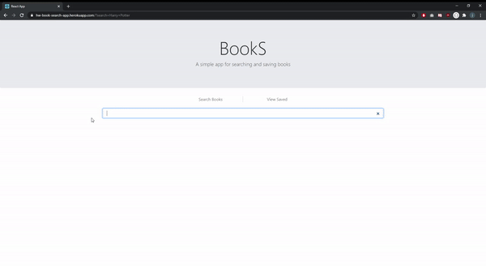

# homework-20-book-app

## Description

MERN stack app for searching and saving books. User can search for books by title (using google books api) view each book's entry on Google Books, and save books to a mongo database. Saved books can be viewed, and deleted from the list.

- - -

## Table of Contents
    

* [Installation](#installation)

* [Usage](#usage)

* [Tests](#tests)

* [License](#lisence)

* [Contributing](#contributing)

* [Questions](#questions)

- - -

## Installation

No installation instructions yet.

- - -

## Usage

App deployed at https://hw-book-search-app.herokuapp.com/. Just start typing in the search bar and books will pop up!

- - -

## Tests

No information about tests yet.

- - -

## License

ISC

- - -

## Contributing

No information about contributing yet.

- - -

## Questions

Please contact electronicallyreached@gmail.com with any questions.
